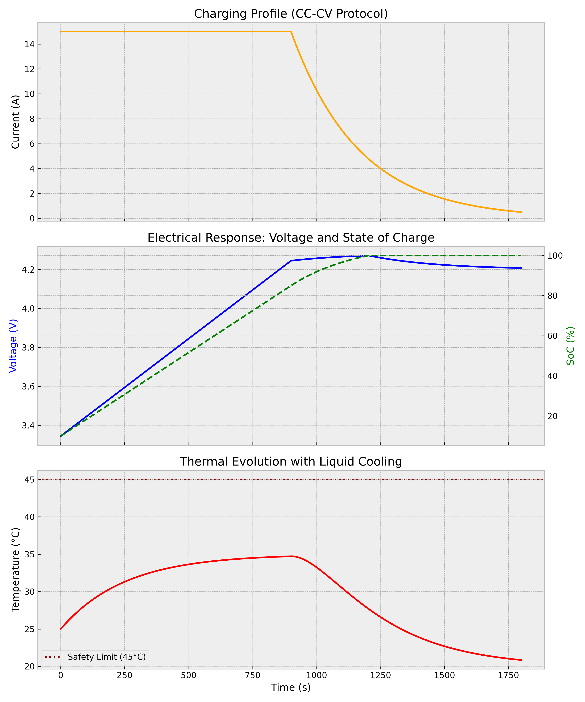

# 🔋 Thermal-Electrical BESS Simulator (Battery Energy Storage System)

Transient Python simulator developed to model the electrical and thermal response of a lithium-ion cell (21700 format) under demanding charging profiles (such as CC-CV protocols), incorporating a liquid cooling management model.

---



---

## 🚀 Key Features

* **Dynamic Electrical Model:** Iterative *time-stepping* calculation of the State of Charge (SoC), Open Circuit Voltage (OCV), and Terminal Voltage considering the internal resistance of the cell.
* **Thermal Model with Liquid Cooling:** Estimation of heat generation via Joule effect and forced convection heat dissipation using a cooling fluid, monitoring thermal safety margins.
* **Advanced Performance Metrics:** Automatic calculation of instantaneous power ($W$), C-rate, dissipated heat, and accumulated energy integration ($Wh$).
* **Automated Results Export:** Generates a comprehensive dataset in CSV format (`bess_complete_results.csv`) alongside a multi-panel engineering-style visual dashboard.

---

## 📊 Results & Simulation Insights

Running the CC-CV charging profile yields the following technical insights:
* **Electrical Behavior:** The cell undergoes a Constant Current (CC) phase at 15 A until reaching the upper voltage threshold (~4.25 V), followed by a Constant Voltage (CV) phase where the current decays exponentially as the State of Charge (SoC) safely reaches 100%.
* **Thermal Performance:** Despite the high initial current stress, the liquid cooling system effectively controls the thermal buildup, peaking at a safe maximum temperature of **~34.73 °C**, remaining well below the strict safety limit threshold of **45 °C**.

---

## 🛠️ Requirements & Installation

The project requires **Python 3.x** and the following data analysis and visualization libraries:

```bash
pip install pandas matplotlib
```
---

## 📂 Repository Structure

```text
├── bess_simulator.py            # Main simulation and dashboard script
├── fast_charging_profile.csv    # Input test profile (Time and Current)
├── bess_complete_results.csv    # Output dataset with calculated metrics
└── dashboard_bess.png           # Automatically generated engineering dashboard
```
---

## ⚙️ How to Run the Simulator

python bess_simulator.py

---

## 👤 Author

Developed by Pau Gimeno as part of engineering projects focused on energy storage and battery systems.

---
